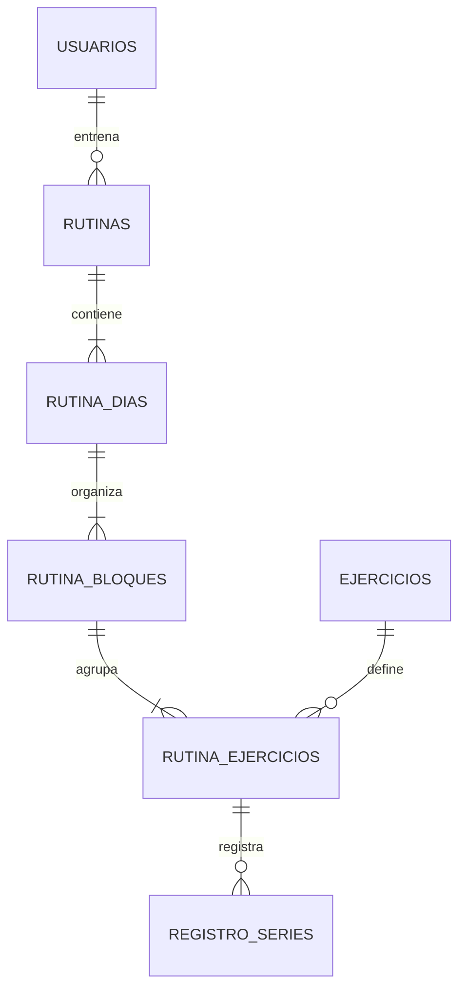

# Estructura de Base de Datos - Aria Training

## 🗄️ Diseño del Modelo de Datos

### Información General
**Versión del esquema:** 1.6 (Actualizado Diciembre 2025)
**Motor de BD:** MariaDB 10.6+
**Arquitectura:** Relacional con relaciones Eloquent
**Convenciones:** Nombres en minúsculas, singular

## 📋 Tablas Principales

### 1. Gestión de Usuarios

#### Tabla: usuarios
**Propósito:** Gestión de usuarios del sistema
| Campo | Tipo | Descripción |
|-------|------|-------------|
| `id` | bigint | PK |
| `tipo_usuario_id` | bigint | FK -> tipo_usuarios.id |
| `usuario` | varchar(255) | Unique |
| `correo` | varchar(255) | Unique |
| `contrasena` | varchar(255) | Hash Bcrypt |
| `nombre_1` | varchar(255) | |
| `apellido_1` | varchar(255) | |
| `estado` | tinyint | 1=Activo, 0=Inactivo |
| `deleted_at` | timestamp | Soft Delete |

#### Tabla: tipo_usuarios
**Propósito:** Roles (1:Admin, 2:Entrenador, 3:Atleta)

### 2. Catálogos de Entrenamiento

#### Tabla: ejercicios
**Propósito:** Biblioteca de ejercicios disponibles
| Campo | Tipo | Descripción |
|-------|------|-------------|
| `id` | bigint | PK |
| `nombre` | varchar(255) | Nombre del ejercicio |
| `grupo_muscular_id` | bigint | FK -> grupos_musculares |
| `equipo_id` | bigint | FK -> equipos |
| `descripcion` | text | Instrucciones generales |
| `video_url` | varchar(255) | Link a YouTube/Vimeo |

#### Tabla: grupos_musculares
**Propósito:** Categorización (Pecho, Espalda, Pierna, etc.)

#### Tabla: equipos
**Propósito:** Equipamiento (Mancuernas, Barra, Máquina)

### 3. Gestión de Rutinas (Core)

#### Tabla: rutinas
**Propósito:** Cabecera de la rutina asignada a un atleta
| Campo | Tipo | Descripción |
|-------|------|-------------|
| `id` | bigint | PK |
| `nombre` | varchar(255) | Ej: "Hipertrofia Fase 1" |
| `atleta_id` | bigint | FK -> usuarios (Atleta) |
| `entrenador_id` | bigint | FK -> usuarios (Creador) |
| `estado` | tinyint | 1=Activa, 0=Inactiva |
| `fecha_inicio` | date | |
| `fecha_fin` | date | |

#### Tabla: rutina_dias
**Propósito:** Días específicos de entrenamiento dentro de una rutina
| Campo | Tipo | Descripción |
|-------|------|-------------|
| `id` | bigint | PK |
| `rutina_id` | bigint | FK -> rutinas |
| `nombre_dia` | varchar(255) | Ej: "Día 1 - Torso" |
| `fecha` | date | Fecha calendario asignada |
| `orden` | int | Secuencia en la semana |

#### Tabla: rutina_bloques
**Propósito:** Agrupación de ejercicios (Biserie, Circuito, Calentamiento)
| Campo | Tipo | Descripción |
|-------|------|-------------|
| `id` | bigint | PK |
| `rutina_dia_id` | bigint | FK -> rutina_dias |
| `nombre` | varchar(255) | Ej: "Bloque A", "Calentamiento" |
| `orden` | int | Orden en el día |
| `tipo` | enum | 'simple', 'biserie', 'triserie', 'circuito' |

#### Tabla: rutina_ejercicios
**Propósito:** Instancia de un ejercicio en un bloque específico
| Campo | Tipo | Descripción |
|-------|------|-------------|
| `id` | bigint | PK |
| `rutina_bloque_id` | bigint | FK -> rutina_bloques |
| `ejercicio_id` | bigint | FK -> ejercicios |
| `series` | int | Número de series prescritas |
| `repeticiones` | varchar(50) | Ej: "10-12", "Fallo" |
| `peso_sugerido` | decimal | Opcional |
| `tempo` | varchar(20) | Ej: "3-0-1-0" |
| `descanso` | int | Segundos de descanso |
| `indicaciones` | text | Notas específicas del entrenador |
| `is_unilateral` | boolean | Si es ejercicio unilateral |
| `track_rpe` | boolean | Si debe registrar RPE |
| `track_rir` | boolean | Si debe registrar RIR |

### 4. Ejecución y Progreso

#### Tabla: registro_series
**Propósito:** Datos reales ingresados por el atleta
| Campo | Tipo | Descripción |
|-------|------|-------------|
| `id` | bigint | PK |
| `rutina_ejercicio_id` | bigint | FK -> rutina_ejercicios |
| `serie_numero` | int | 1, 2, 3... |
| `peso` | decimal | Kg/Lb levantados |
| `reps` | int | Repeticiones reales |
| `rpe` | decimal | Esfuerzo percibido (1-10) |
| `rir` | int | Reps en reserva |
| `completed_at` | timestamp | Cuándo se marcó check |

### 5. Auditoría

#### Tabla: audit_logs
**Propósito:** Registro de seguridad de todas las acciones
| Campo | Tipo | Descripción |
|-------|------|-------------|
| `user_id` | bigint | Quién hizo la acción |
| `action` | varchar | create, update, delete, restore, force_delete |
| `model` | varchar | Clase del modelo afectado |
| `model_id` | bigint | ID del registro afectado |
| `old_values` | json | Snapshot antes del cambio |
| `new_values` | json | Snapshot después del cambio |
| `ip_address` | varchar | IP del usuario |

## 🔗 Diagrama Relacional Simplificado

## 📈 Optimizaciones (v1.6)

### Índices Estratégicos
- `rutinas(atleta_id, estado)`: Para dashboard de atleta.
- `rutina_dias(fecha)`: Para calendario.
- `audit_logs(model, model_id)`: Para historial de cambios.

### Eager Loading
Todos los modelos principales implementan `scopeWithRelations` para cargar jerarquías completas (Rutina -> Días -> Bloques -> Ejercicios) en una sola consulta optimizada.
