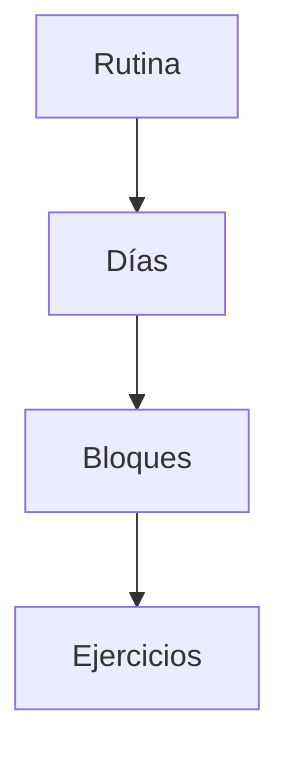

# Gestión de Rutinas (v1.6)

## 📋 Descripción General

El módulo de Gestión de Rutinas es el núcleo de la planificación del entrenamiento en Aria Training. Permite a los entrenadores diseñar programas de entrenamiento complejos, estructurados por días y bloques, y asignarlos a sus atletas.

### Arquitectura de la Rutina

La estructura de una rutina sigue una jerarquía estricta para garantizar flexibilidad y orden:

1.  **Rutina:** El contenedor principal (ej. "Hipertrofia Fase 1"). Tiene fecha de inicio y fin.
2.  **Día:** Una sesión de entrenamiento específica (ej. "Lunes - Pierna"). Se asigna a una fecha del calendario.
3.  **Bloque:** Agrupación lógica de ejercicios dentro de un día.
    *   *Tipos:* Simple, Biserie, Triserie, Circuito, Calentamiento.
4.  **Ejercicio:** La unidad mínima de trabajo (ej. "Sentadilla", "Press Banca").

---

## 🛠️ Funcionalidades Clave

### 1. Editor de Rutinas (Drag & Drop)

El editor de rutinas ha sido rediseñado en la versión 1.6 para ofrecer una experiencia fluida y visual.

*   **Tecnología:** Implementado con **SortableJS** integrado en Livewire.
*   **Capacidades:**
    *   **Reordenar Bloques:** Arrastrar bloques completos para cambiar su orden en el día.
    *   **Reordenar Ejercicios:** Mover ejercicios entre bloques o cambiar su orden dentro del mismo bloque.
    *   **Feedback Visual:** Indicadores de "ghost" al arrastrar para previsualizar la posición.
    *   **Persistencia:** Los cambios de orden se guardan automáticamente en la base de datos vía Livewire.

### 2. Gestión de Bloques

Los bloques permiten estructurar la sesión de entrenamiento de manera profesional.

*   **Creación:** Botón "Añadir Bloque" en el editor del día.
*   **Tipos de Bloque:**
    *   **Simple:** Ejercicios secuenciales estándar.
    *   **Biserie/Triserie:** Ejercicios realizados sin descanso entre ellos. Visualmente agrupados.
    *   **Circuito:** Múltiples ejercicios en rotación.
*   **Edición:** Se puede cambiar el nombre del bloque (ej. de "Bloque 1" a "Calentamiento") haciendo clic en el título.

### 3. Tarjeta de Ejercicio Inteligente

Cada ejercicio se presenta en una tarjeta interactiva con campos optimizados:

*   **Series y Repeticiones:** Inputs numéricos y selectores de rango (ej. "10-12").
*   **Carga (Peso):** Input para peso sugerido o % del RM.
*   **Tempo:** Formato estándar de 4 dígitos (ej. 3-0-1-0).
*   **Descanso:** Selector de tiempo de descanso.
*   **Notas:** Campo de texto expandible para indicaciones específicas.
*   **RPE/RIR:** Checkboxes para activar el seguimiento de intensidad subjetiva.
*   **Unilateral:** Checkbox para indicar si el ejercicio se realiza por lado.

### 4. Calendario Interactivo

La vista de calendario permite visualizar y organizar la distribución semanal del entrenamiento.

*   **Asignación:** Arrastrar días desde el "Banco de Días" hacia el calendario.
*   **Movimiento:** Mover días ya asignados de una fecha a otra.
*   **Clonación:** Opción para duplicar un día completo (ej. repetir la rutina de pierna).

---

## 💻 Implementación Técnica

### Componentes Livewire

*   `GestionarRutinas`: Vista principal (lista de rutinas).
*   `GestionarRutinaCalendario`: Vista de calendario y banco de días.
*   `GestionarDiaRutina`: Editor detallado del día (Bloques y Ejercicios).

### Modelo de Datos (Relaciones)

*   `Rutina` hasMany `RutinaDia`
*   `RutinaDia` hasMany `RutinaBloque`
*   `RutinaBloque` hasMany `RutinaEjercicio`
*   `RutinaEjercicio` belongsTo `Ejercicio`

### Validaciones

*   No se puede eliminar un bloque si contiene ejercicios (deben moverse o eliminarse primero).
*   La fecha de fin de la rutina no puede ser anterior a la fecha de inicio.
*   Solo se puede tener una rutina "Activa" por atleta simultáneamente.
