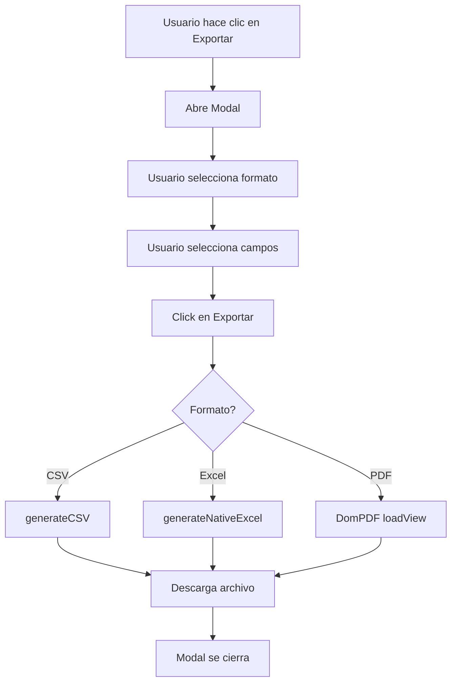

# Sistema de Exportación de Auditoría - Aria Training (v1.3)

## 📋 Información General

**Versión:** 1.3  
**Fecha de implementación:** Octubre 2025  
**Módulo:** Sistema de Auditoría (Administrador)  
**Responsable:** Fernando Botero

## 🎯 Objetivo del Sistema

Proporcionar a los administradores una herramienta completa para exportar logs de auditoría en múltiples formatos profesionales (CSV, XLSX, PDF), permitiendo análisis externo, reportes y cumplimiento normativo.

## 🏗️ Arquitectura del Sistema

### Componentes Principales

```
┌─────────────────────────────────────────────────────────┐
│                  CAPA DE PRESENTACIÓN                    │
│  ┌──────────────────────────────────────────────────┐  │
│  │   gestionar-auditoria.blade.php                  │  │
│  │   - Botón "Exportar"                             │  │
│  │   - Modal de Opciones                            │  │
│  │   - Radio Buttons (CSV/Excel/PDF)                │  │
│  │   - Checkboxes Campos                            │  │
│  └──────────────────────────────────────────────────┘  │
└─────────────────────────────────────────────────────────┘
                          ↓
┌─────────────────────────────────────────────────────────┐
│                CAPA LÓGICA (LIVEWIRE)                   │
│  ┌──────────────────────────────────────────────────┐  │
│  │   GestionarAuditoria.php                         │  │
│  │   - openExportModal()                            │  │
│  │   - closeExportModal()                           │  │
│  │   - exportWithOptions()                          │  │
│  │   - resetExportOptions()                         │  │
│  └──────────────────────────────────────────────────┘  │
└─────────────────────────────────────────────────────────┘
                          ↓
┌─────────────────────────────────────────────────────────┐
│            CAPA DE CONTROLADOR (BACKEND)                │
│  ┌──────────────────────────────────────────────────┐  │
│  │   AuditoriaController.php                        │  │
│  │   - export()                                     │  │
│  │   - generateCSV()                                │  │
│  │   - generateNativeExcel()                        │  │
│  │   - parseUserAgent()                             │  │
│  └──────────────────────────────────────────────────┘  │
└─────────────────────────────────────────────────────────┘
                          ↓
┌─────────────────────────────────────────────────────────┐
│                CAPA DE GENERACIÓN                        │
│  ┌──────────────────────────────────────────────────┐  │
│  │   PhpSpreadsheet (Excel)                         │  │
│  │   PHP Native (CSV)                               │  │
│  │   DomPDF (PDF)                                   │  │
│  └──────────────────────────────────────────────────┘  │
└─────────────────────────────────────────────────────────┘
```

## 🛠️ Tecnologías Utilizadas

| Tecnología | Versión | Propósito |
|------------|---------|-----------|
| **Laravel** | 12.34.0 | Framework backend |
| **Livewire** | 3.6 | Componentes reactivos |
| **Alpine.js** | Integrado | Interactividad frontend |
| **PhpSpreadsheet** | 5.1 | Generación XLSX nativa |
| **DomPDF** | 3.1 | Generación PDF |
| **PHP** | 8.2.12 | Lenguaje base |

## 📊 Formatos de Exportación

### 1. CSV (Comma-Separated Values)

**Archivo generado:** `auditoria_YYYY-MM-DD_HH-MM-SS.csv`

**Características:**
- Delimitador: Punto y coma (;)
- Encoding: UTF-8 con BOM
- Campos entrecomillados
- Compatible con Excel, LibreOffice, Google Sheets

**Implementación:**
```php
private function generateCSV($query, $selectedFields): void
{
    $file = fopen('php://output', 'w');
    fprintf($file, chr(0xEF).chr(0xBB).chr(0xBF)); // BOM UTF-8
    fputcsv($file, $headers, ';', '"');
    // ... datos
    fclose($file);
}
```

### 2. XLSX (Excel Nativo)

**Archivo generado:** `auditoria_YYYY-MM-DD_HH-MM-SS.xlsx`

**Características:**
- Formato OpenXML nativo
- Headers con estilo (negrita + fondo gris)
- Columnas auto-ajustadas
- Sin advertencias de seguridad
- Compatible con Microsoft Excel 2007+

**Implementación:**
```php
private function generateNativeExcel($query, $selectedFields, $filename)
{
    $spreadsheet = new Spreadsheet();
    $sheet = $spreadsheet->getActiveSheet();
    $sheet->setTitle('Auditoría');
    
    // Estilo headers
    $sheet->getStyle('A1')->getFont()->setBold(true);
    $sheet->getStyle('A1')->getFill()
        ->setFillType(Fill::FILL_SOLID)
        ->getStartColor()->setARGB('FFE2E8F0');
    
    // Auto-ajuste
    $sheet->getColumnDimension('A')->setAutoSize(true);
    
    $writer = new Xlsx($spreadsheet);
    // ... descarga
}
```

### 3. PDF (Portable Document Format)

**Archivo generado:** `auditoria_YYYY-MM-DD_HH-MM-SS.pdf`

**Características:**
- Tabla formateada
- Headers informativos
- Estilos CSS incluidos
- Compatible con todos los visores PDF

**Vista utilizada:** `resources/views/exports/auditoria.blade.php`

## 🎨 Interfaz de Usuario

### Modal de Exportación

El modal permite al usuario personalizar completamente su exportación:

**Secciones:**
1. **Formato de Exportación:** Radio buttons exclusivos (CSV/Excel/PDF)
2. **Campos a Incluir:** 11 checkboxes para selección granular
3. **Botones de Acción:** Cancelar / Exportar

**Estados visuales:**
- Formato seleccionado: Borde verde + fondo verde claro
- Formato no seleccionado: Borde gris
- Hover: Fondo gris claro

### Campos Exportables

| Campo | Nombre Técnico | Tipo de Dato |
|-------|----------------|--------------|
| Fecha | `fecha` | DateTime |
| Usuario | `usuario` | String |
| Acción | `accion` | String |
| Modelo | `modelo` | String |
| ID Registro | `id_registro` | Integer |
| IP Address | `ip_address` | String |
| Valores Anteriores | `valores_anteriores` | JSON |
| Valores Nuevos | `valores_nuevos` | JSON |
| Navegador | `navegador` | String (parseado) |
| Sistema Operativo | `sistema_operativo` | String (parseado) |
| User Agent Completo | `user_agent_completo` | String |

## 🔧 Configuración Técnica

### Rutas

```php
// routes/web.php
Route::middleware(['auth', 'can:viewAny,App\Models\AuditLog'])
    ->group(function () {
        Route::get('/admin/auditoria/export', [AuditoriaController::class, 'export'])
            ->name('admin.auditoria.export');
    });
```

### Componente Livewire

**Propiedades:**
```php
public bool $showExportModal = false;
public string $exportFormat = 'csv';
public array $exportOptions = [
    'fecha' => true,
    'usuario' => true,
    'accion' => true,
    // ... más campos
];
```

**Métodos clave:**
- `openExportModal()`: Abre el modal
- `closeExportModal()`: Cierra el modal
- `exportWithOptions()`: Procesa la exportación
- `resetExportOptions()`: Restaura valores por defecto

### Parámetros de URL

La exportación se realiza mediante redirect con parámetros GET:

```
/admin/auditoria/export?
    format=excel&
    fecha=1&
    usuario=1&
    accion=1&
    modelo=1&
    // ... más parámetros
```

## 🔍 Parseo de User Agent

El sistema incluye un método inteligente para detectar navegadores y sistemas operativos:

```php
private function parseUserAgent(string $userAgent): array
{
    // Detecta: Chrome, Firefox, Edge, Safari, Opera
    // Detecta: Windows, macOS, Linux, Android, iOS
    return [
        'browser' => 'Chrome 120.0',
        'os' => 'Windows 10'
    ];
}
```

## 📦 Dependencias

### Instaladas

```json
{
    "require": {
        "php": "^8.2",
        "laravel/framework": "^12.0",
        "livewire/livewire": "^3.6",
        "phpoffice/phpspreadsheet": "^5.1",
        "barryvdh/laravel-dompdf": "^3.1"
    }
}
```

### Eliminadas (Obsoletas)

- ❌ `maatwebsite/excel` v1.1 (2014)
- ❌ `phpoffice/phpexcel` v1.8.1 (abandonada)

**Razón:** Incompatibilidad con PHP 8.2, 20 vulnerabilidades de seguridad

## 🚀 Flujo de Exportación



## ✅ Mejores Prácticas Implementadas

1. **Separación de Responsabilidades**
   - Vista: Solo presentación
   - Livewire: Lógica de UI
   - Controlador: Lógica de negocio
   - Generadores: Creación de archivos

2. **Seguridad**
   - Validación de permisos con policies
   - Escapado de caracteres especiales
   - Headers HTTP correctos
   - No exponer rutas internas

3. **Rendimiento**
   - Streaming de archivos grandes
   - No cargar todo en memoria
   - Queries optimizadas con eager loading

4. **Mantenibilidad**
   - Código comentado
   - Métodos pequeños y específicos
   - Nombres descriptivos
   - Documentación completa

## 🧪 Testing

### Pruebas Manuales Recomendadas

1. **Exportación CSV**
   - Abrir en Excel
   - Verificar acentos
   - Confirmar delimitadores

2. **Exportación Excel**
   - Abrir en Microsoft Excel
   - Verificar sin advertencias
   - Confirmar estilos de headers

3. **Exportación PDF**
   - Abrir en visor PDF
   - Verificar formato de tabla
   - Confirmar todos los datos

4. **Selección de Campos**
   - Desmarcar varios campos
   - Exportar y verificar
   - Confirmar solo campos seleccionados

## 📝 Mantenimiento

### Agregar Nuevo Campo Exportable

**Paso 1:** Actualizar propiedad en `GestionarAuditoria.php`
```php
public array $exportOptions = [
    // ... campos existentes
    'nuevo_campo' => true,
];
```

**Paso 2:** Agregar checkbox en vista Blade
```html
<label class="flex items-center">
    <input type="checkbox" wire:model="exportOptions.nuevo_campo">
    <span class="ml-2">Nuevo Campo</span>
</label>
```

**Paso 3:** Actualizar métodos de generación en `AuditoriaController.php`
```php
if ($selectedFields['nuevo_campo']) {
    $sheet->setCellValue($col++ . $row, $log->nuevo_campo);
}
```

## 🐛 Problemas Comunes y Soluciones

| Problema | Causa | Solución |
|----------|-------|----------|
| Archivo corrupto | Headers incorrectos | Verificar Content-Type |
| Acentos incorrectos | Encoding erróneo | Usar UTF-8 con BOM |
| Excel no abre | Formato no coincide | Usar PhpSpreadsheet |
| Modal no cierra | Redirect inmediato | Ya implementado correctamente |

## 📊 Métricas del Sistema

- **Tiempo promedio exportación CSV:** < 1s
- **Tiempo promedio exportación Excel:** < 2s  
- **Tiempo promedio exportación PDF:** < 3s
- **Tamaño promedio archivo (1000 logs):** ~500KB
- **Compatibilidad navegadores:** 100% (Chrome, Firefox, Safari, Edge)

---

**Documento técnico del Sistema de Exportación de Auditoría v1.3**  
*Última actualización: Octubre 2025*
